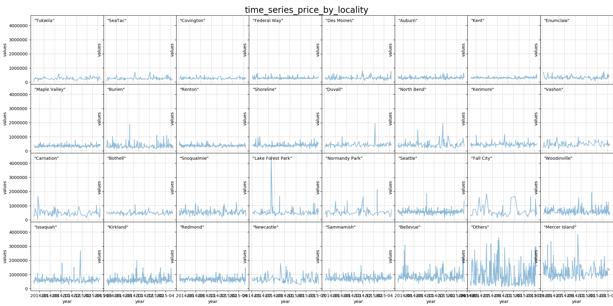
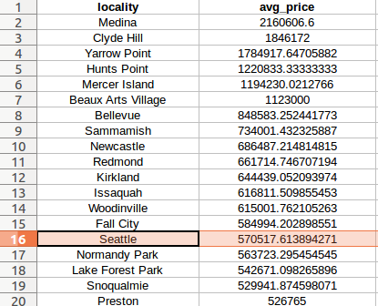
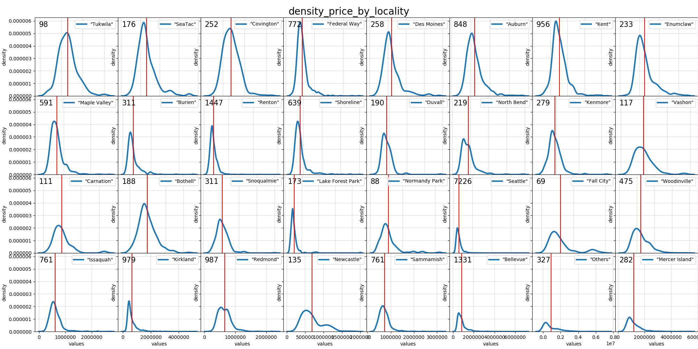
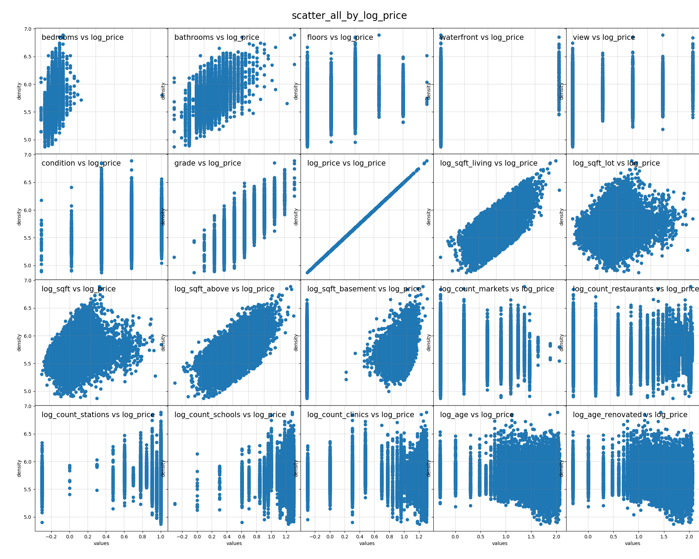
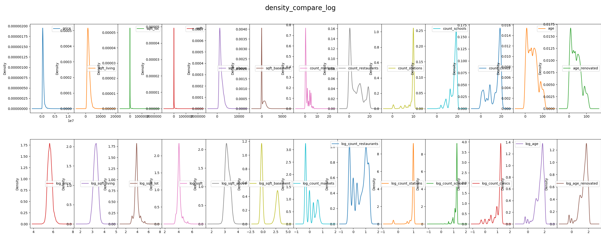
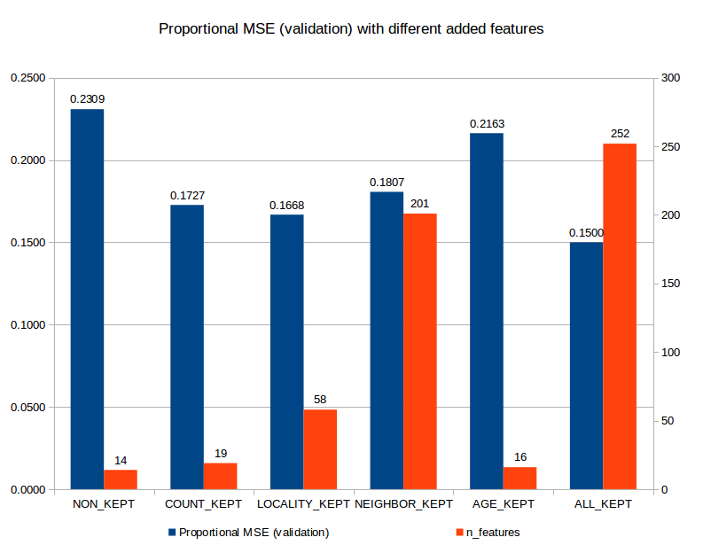
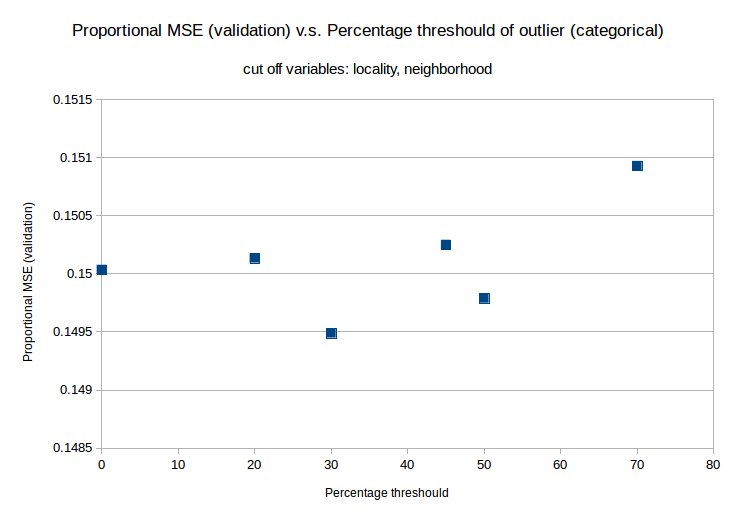
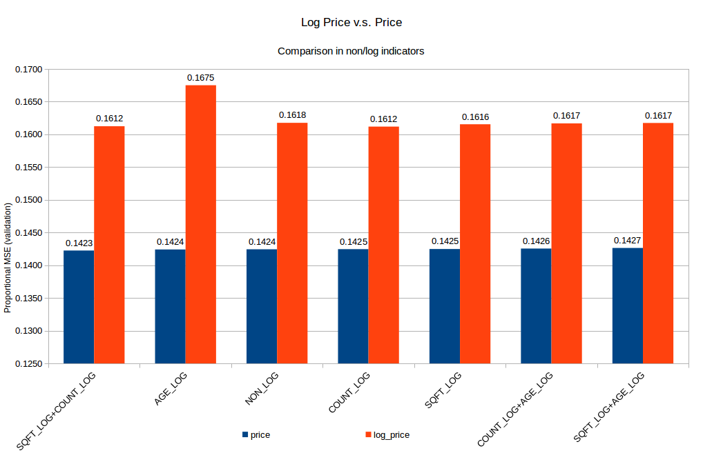
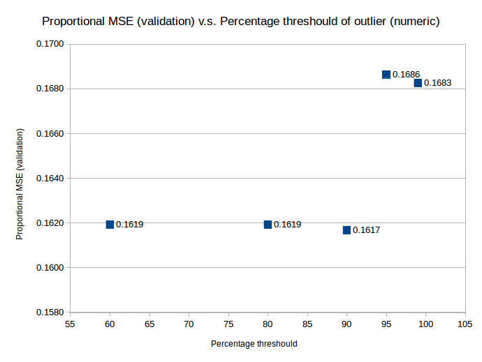
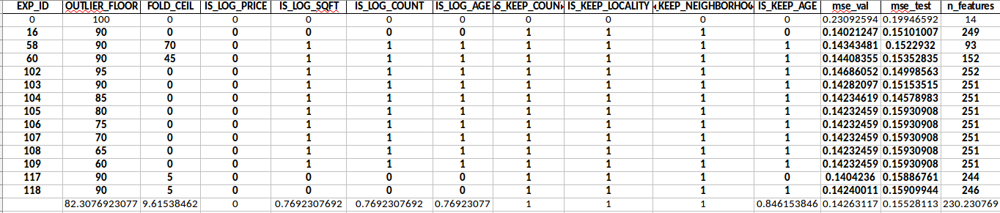

---
output:
  html_document: default
  pdf_document: default
  word_document: default
---

## House Prices Analysis Report

### Strayn Wang

This report has 4 sections: **README, Understanding the Problem, Data Exploration, Machine Learning**.  

### README
The code for this report is well-documented in the form of python files, where,  
```./lib/1.geo_recovering.py``` reads the original data and impute streets, neighborhoods, cities, counties, states, countries information to the data, and search & count the number of clinics, schools, restaurants, supermarkets, transportations around the location by Google Geocoding API.  
```./lib/2.prepare_data.py``` transforms/adds features by analysis specified in this report.
```./lib/3.split_train_val_test.py``` prepares the training/validation/testing data used for machine learning model.  
```./lib/4.feature_engineering.py``` defines experiment criteria used for training/testing different model iteratively for the purpose of feature engineering.  

All experiments conditions and results are stored in ```./experiments/exp_logs.xlsx```

```./visualize/visualize.py``` is code for visualizations.

```./tmp``` stores the intermediate data.

```./logs``` stores the logs of model training.

```./data``` stores the original data used for this project, which can be easily changed to data with a similar format.


### Understanding the Problem
Essentially, the price changes can be divided into two parts: changes from the vehicle of the housing market and the quality of the house itself.

The market-level analysis is hard to be done since the window of House Prices Data is only 2 years. You can skip to the next paragraph if you are more interested in this specific data problem. Here I list the potential market-level analysis that can be done given more data and longer time:  
1) **Substitutes Analysis**, e.g. trends of House Renting market can influence the House Buying market prices. 
2) **Rivalry Analysis**, e.g. competitors' new products can change the rivalry dynamic and influence the prices on the market.
3) **New Entrants Analysis**, e.g. newcomers can bring new technology that changes the game or consume more raw materials that influence costs and prices. 
4) **Bargaining Power of Buyers Analysis**, e.g. demographical changes over the area (growth of population, etc.) may change supplier/buyer ratio; also, customer's personal background, for example, her banking credit histories sometimes can influence the prices she gets. 

We can do a product-level analysis for this single data set, which focuses on the **Bargaining Power of Suppliers**. 
The deal-breaking factors for house buyers are:
1. **Property**: Amenity, Age, structure, area size, decoration, luxury.
2. **Policy**: tax rate, interest rate, economic conditions.
3. **Location**: Neighborhood Safety, Transportation, Commercials (groceries, markets, restaurants), Schools (benefit for new parents), Hospitals (benefit for the old).
(More details can be found in this [quora answer](https://www.quora.com/What-factors-affect-real-estate-prices).)  

Our dataset has rich information for **property**, such as:
- overall score: 'grade';  
- structures: 'bedrooms', 'bathrooms', 'floors', 'waterfront', 'view';  
- area size: 'sqft_living','sqft_lot','sqft_above', 'sqft_basement', 'sqft_living15', 'sqft_lot15';  
- age: 'condition','date', 'yr_built', 'yr_renovated';

**Policies** seem a complicated & hard question, but actually, they are the same in one state, therefore, adding a categorical state name variable can roughly carry this information. However, since sales records in our data are only in Washington, this can be ignored.

**Location** carries rich deal-breaking information and we get the latitude and longitude, it is promising to spend sometime recover it.  
I use [Google Reverse Geocoding API](https://developers.google.com/maps/documentation/geocoding/intro) to recover **Street, Neighborhood, County, State, Country** information from longitude and altitude.  
I then use [Google Place API](https://developers.google.com/places/web-service/intro) to search & count **Transportation, Supermarkets, Restaurants** in 10 minutes walking distance and *Schools and Hospitals** in 30 minutes walking distance.  

The imputed data can be found in ```./tmp/data_imputed.csv```.   
The API query code can be found in ```./lib/geo_recovering.py```.

### Data Exploration
#### 1. How prices flow with time (Time Series Analysis)  

Whether it is reasonable to predict future by model depends on whether the price pattern is constant over time. I plot the daily mean price for each city (locality in the plot):  
 

Peaks can be found in 8/32 cities we have (Seattle, Carnation, Lake Forest Park, Burien, Issaquah, Normandy Park, Bellevue, Mercer Island), not too many, and we can say the price is stable/stationary in the 2-year window. It means we can create a model ignoring absolute time,  which means we can transform columns like yr_built/yr_renovated to relative time, e.g. age/age_renovated or simply delete them.

#### 2. How prices stretch by values (Distribution Analysis)  

I print the mean price for different cities in Washington.   
   

Seattle, the only city I ever heard of in Washington, whose house average prices rank 16. And [Medina](https://en.wikipedia.org/wiki/Medina,_Washington), the most expensive city in Washington has itself surrounding by the pretty Lake Washington.  

More details can be found in the following density plot:   


The number on the plot indicate the count of data in that region. It is clear to see that most of the sales (7226/21590) go to Seattle. Another point is that a majority of the regional prices have long tails. Normally, if the long tails take up big proportion in a variable, we may benefit from logarithm transformation of the variable since it rebalances the data by reducing the skewness.

#### 3. How price correlates to indicators (Correlation Analysis)  

To show this I made the scatter plots between each indicator to the logarithm of price:    


Out of all columns, the grade, size of the living room (sqft_living), waterfront, size of the above (sqft_above) have the strongest correlation on the plot (this is further shown in importance analysis).

Code of visualizing can be found in ```./visualize/visualize.py```. 

### Machine Learning

#### 1. Data preparation
I take [Issaquah](https://en.wikipedia.org/wiki/Issaquah,_Washington), a city with 761 records whose average price is 644439.05 to be the test set.

I split the rest data into 8/2, where the training set has 16663 records and validation set has 4166 records.

Code of preparing training/validation/testing dataset is in ```./lib/split_train_val_test.py```.

#### 2. Feature Engineering  
I extract the following columns out of the original data:   
- **age**: age of the house, age = date - yr_built.  
- **age_renovated**: time since last renovate, age_renovated = date - yr_renovated.  
- **sqft** = sqft_above+sqft_basement+sqft_living+sqft_lot.  
- **count_markets**: the count of supermarkets in a radius of 800.  
- **count_restaurants**: the count of restaurants in a radius of 800.  
- **count_stations**: the count of transition stations in a radius of 800.  
- **count_schools**: the count of schools in a radius of 2400.  
- **count_clinics**: the count of clinics in a radius of 2400.  
- **logarithm form** for selective variables.  

I compare the **logarithm form** and original form of a selected list of variables:    


We have recovered/transformed enough features, next, we need to reduce redundancies/noises for modeling. At feature-level, highly correlated features can confuse the model, for example, the presence of both **age** (age = date - yr_built ) and **yr_built** not only increase computation but also can reduce coefficients of each one of them; at record-level, outliers that share significant different values may bias the model. To find which features/outliers to delete/transform, I will use a trained model validation performance as criteria.   

Code of preparing data can be found in ```./lib/prepare_data.py```.

#### 3. Model Setup
When a human customer goes to buy a house it can be thought as a combination of decisions over different perspectives, a decision tree, which is born to mimic human decision-making process seems a good fit for such task. Since the perspectives to be considered are many, the house price patterns vary geographically and property-wisely, therefore, I use a bootstrap-upgraded decision called Random Forest to ensure robustness.    

The best part for using Random Forest is that it doesn't have any assumptions like those of Linear Regressions: **Multivariate normality, Linear relationship, No multicollinearity, No auto-correlation**, etc. Although this should be checked to help approach better performance or robustness, these are not required here.  

A bonus for Random Forest is that we can check feature (node) importance like we do for P-Values Check in Linear Regression, which helps us to find the best features.


#### 4. Loss function and metrics
I choose **Mean Squared Error** as loss function for machine learning since it is faster than Mean Absolute Error. Doing so causes a potential problem of bias over the outliers to have bigger values, two solutions to this:
- Delete outliers by a threshold.   
- Transform the skewed data with logarithm.  

On evaluating results, I didn't use MSE directly but use proportional MAE, which is Mean Absolute Error divided by mean of true labels.  
$$
MAE^{prop}_{i} = \frac{MAE_{i}}{\frac{1}{N}\sum_{N}{Y^{true}_{i}}}
$$  

where $N$ is the size of the test batch, $Y^{true}_{i}$ is the true values of prices, $MAE$ are the Mean Absolute Error.

#### 5. Experiments
#### 5.1. Do added features make sense?
I show the effects of added features in the following plot:    


Comparing to the baseline (NON_KEPT, where we use all 14 original features came with the dataset), all added features improve the validating Proportional MAE to different extents. Among them, COUNT_KEPT and LOCALITY_KEPT significantly improve the prediction.  

Though not shown in the plot, testing Proportional MAE indicates the direct uses of features of locality and neighborhood lead to overfitting. To improve, I merged small-sized categories (e.g. under locality we have some cities getting only 1 record) under locality/neighborhood to a category called "Others" (which is also the category for unobserved locality/neighborhood in training dataset). The following plot indicates that the quantile of 30% is a good threshold for deciding "small categories".  
  

Alternative ways to deal with a large number of feature reduction automatically are [LASSO](https://en.wikipedia.org/wiki/Lasso_(statistics)), or stepwise [AIC](https://en.wikipedia.org/wiki/Akaike_information_criterion), [BIC](https://en.wikipedia.org/wiki/Bayesian_information_criterion), however, given limited time I only tried AIC, but my first try wasn't good enough for selecting categories under locality/neighborhood, I will continue this effort given more time.

#### 5.2. Does logarithm transformation help to rebalance skewness?
As stated in section 4, we use logarithm transformation to deal with skewed data issue. We first try to implement it on price:   


Results show that it harms the validating Proportional MAE, though a further check shows that it helps increase robustness (differences between validating Proportional MAE and testing Proportional MAE). I haven't got enough time to analyze whether the incorrect predictions are for the smaller/bigger-value prices.  

#### 5.3. Does Threshold help to cutoff outliers?
To cutoff outliers bigger than a threshold of 90, which means for all numeric indicators, any values bigger than 90% quantile of for this indicator will be deleted. The experiment shows it helps to decrease validating Proportional MAE:  


Given limited time, I only show the points, a better way of doing this is to cutoff by clustering or by assumed distribution like multivariate Gaussian.

#### 5.4. Current Results
Based on insights from 5.1~5.3, I zoom in on 10 different experiment factors and set up 127 experiments. By the criteria of validating Proportional MAE and testing Proportional MAE, I found the best models and list them here, this table also shows the 10 experimental factors:  


The 127 experiments can be found in ```./experiments/exp_logs.xlsx```.

The best models have an average validating Proportional MAE of 0.1426 and a testing Proportional MAE of 0.1553, whereas the baseline models have a validating Proportional MAE of 0.2310 and an average testing Proportional MAE of 0.1995.  **An average of 62% improvement** has been seen on the dataset! The feature engineering efforts are quite rewarding.

The code of feature engineering can be found in ```./lib/feature_engineering.py```.

#### 6. Error Analysis (haven't done)
Plot the error and check its distribution (expected to be normally distributed), if there are any significant patterns in error distribution, Gradient Boost Random Forest can be implemented to improve the prediction.

#### 7. Node Importance Analysis (haven't done)
Identify the most important nodes of the optimal model.  

#### 8. Conclusions
1. Replacing prices with logged prices increase robustness but hurt model fitting, it can be improved by replacing logarithm with Box-Cox transformation.  

2. Logged count, logged age, and logged sqft didn't improve much than their original forms, but they should be kept since they help to moderate robustness issue caused by taking MSE loss, which is biased for outliers. In another word, the log-transformed features may keep the model prediction consistently accurate even when encountering outliers in the future batches of testing data.

3. Count and locality provide the biggest improvement for prediction (minimizing validating Proportional MAE). But a lower testing performance comparing to validating performance suggests overfitting. Additionally, since locality and neighborhood cover only information in Washington, whether to keep them or not depends on what kind/size of future data we will be given in the real implementation of this problem.

4. Given more time to collect data, the market-level analysis is expected to improve the models.
